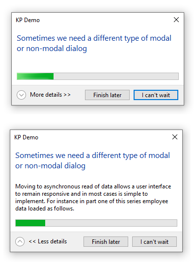
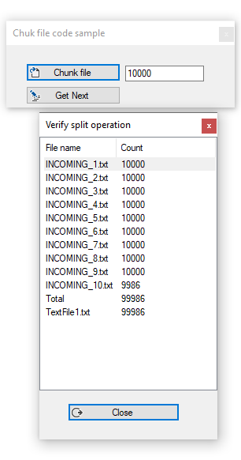

# Working with files better

In this repository there are two demos

- [Using Windows-API-Code-Pack-1.1](https://github.com/aybe/Windows-API-Code-Pack-1.1) (installed using NuGet) to provide a modal dialog while reading a text file with a progress bar along with the ability to cancel the read operation.
- Chunking a larger file into smaller files (pure .NET Framework 4.7.2) which can help processing text files in smaller portions rather than loading a very large text file into memory all at once.

### Important

- After loading this solution into Visual Studio perform a **restore NuGet packages** before a build/run.
- There is a post build event to create a folder under the application folder for chunking files.

#### Microsoft TechNet article

[See article here](https://social.technet.microsoft.com/wiki/contents/articles/53922.reading-large-files-made-simple-vb-net.aspx)

**User interface**

**Chunking files**

